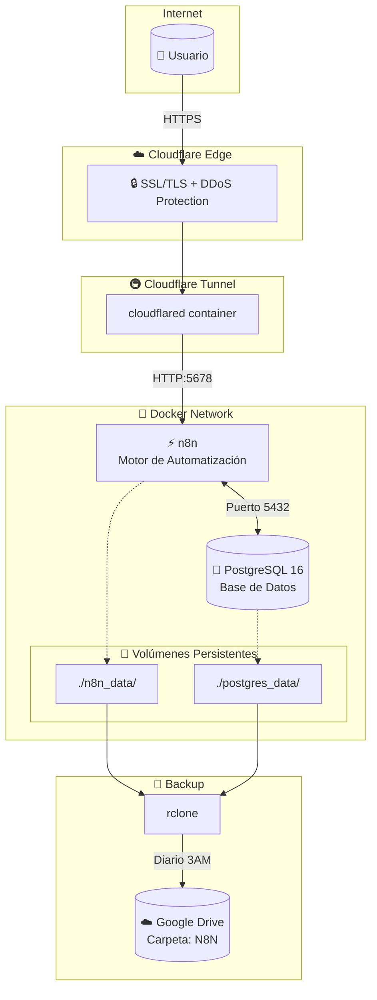

# 🔄 n8n Self-Hosted

> **Automatización sin límites** — Despliega tu propia instancia de n8n con PostgreSQL y Cloudflare Tunnel.

[](https://n8n.io)
[](https://docs.docker.com/compose/)
[](https://www.postgresql.org/)
[](https://developers.cloudflare.com/cloudflare-one/connections/connect-apps/)
[](https://rclone.org/)
[](LICENSE)

<p align="center">
  
</p>

---

## ✨ Características

| 🚀 Producción Lista | 🔒 Seguridad Integrada |
|:---|:---|
| PostgreSQL 16 como base de datos persistente | Cloudflare Tunnel para acceso seguro sin puertos expuestos |
| Healthchecks automáticos | Encriptación de credenciales con clave personalizada |
| Reinicio automático de servicios | Opción para deshabilitar registro público |
| Limpieza automática de ejecuciones (14 días) | Variables sensibles fuera del repositorio |

| 🐳 Docker Native | ⚡ Fácil Mantenimiento |
|:---|:---|
| Orquestación con Docker Compose | Comandos simples para actualizar |
| Volúmenes persistentes para datos | Backup y restauración sencilla |
| Imágenes oficiales siempre actualizadas | Logs centralizados |

---

## 🚀 Inicio Rápido

### Prerrequisitos

- Docker y Docker Compose instalados
- Cuenta en Cloudflare con acceso a Zero Trust (para túnel)
- Dominio configurado en Cloudflare
- rclone configurado con Google Drive (para backups)

> 📘 **Compatible con LXC/Proxmox**: Los scripts detectan automáticamente si se ejecutan como root.

### 1. Clonar el repositorio

```bash
git clone https://github.com/herwingx/n8n-self-hosted.git
cd n8n-self-hosted
```

### 2. Configurar variables de entorno

```bash
# Copiar archivo de ejemplo
cp .env.example .env

# Generar clave de encriptación segura
openssl rand -hex 32
# Copiar el resultado en N8N_ENCRYPTION_KEY

# Editar .env con tus valores
nano .env
```

### 3. Configurar Cloudflare Tunnel

1. Ir a [Cloudflare Zero Trust](https://one.dash.cloudflare.com)
2. Navegar a **Access → Tunnels → Create a tunnel**
3. Copiar el token del túnel en `CF_TUNNEL_TOKEN`
4. Configurar el túnel para apuntar a `http://n8n:5678`

### 4. Iniciar servicios (primera vez)

```bash
docker compose up -d
```

### 5. Configurar permisos de carpetas

> ⚠️ Ejecutar después del primer inicio, cuando Docker crea las carpetas.

```bash
# Opción 1: Usar el script (recomendado)
./scripts/fix-permissions.sh

# Opción 2: Manual
sudo chown -R 1000:1000 ./n8n_data      # n8n (UID 1000)
sudo chown -R 70:70 ./postgres_data      # PostgreSQL (UID 70)
docker compose restart
```

### 6. Acceder a n8n

Abre `https://n8n.tudominio.com` en tu navegador.

---

## 🏗️ Arquitectura



---

## 📦 Comandos Útiles

### Gestión de Servicios

```bash
# Iniciar todos los servicios
docker compose up -d

# Detener todos los servicios
docker compose down

# Ver logs en tiempo real
docker compose logs -f

# Ver logs de un servicio específico
docker compose logs -f n8n
```

### 🔄 Actualizar n8n

```bash
# Descargar última imagen
docker compose pull n8n

# Reiniciar con la nueva imagen
docker compose up -d n8n

# Verificar versión actual
docker compose exec n8n n8n --version
```

### 💾 Backup Automático (Google Drive)

Este proyecto incluye un sistema de backup automático a Google Drive usando rclone.

```bash
# Ejecutar backup manual
./scripts/backup.sh

# Ver logs de backup
tail -f backups/backup.log

# Restaurar (modo interactivo)
./scripts/restore.sh

# Listar backups disponibles (local + Drive)
./scripts/restore.sh --list
```

> 📘 Los backups se ejecutan automáticamente cada día a las 3:00 AM vía cron.

### 🔧 Mantenimiento

```bash
# Ver estado de los contenedores
docker compose ps

# Reiniciar un servicio específico
docker compose restart n8n

# Limpiar imágenes no utilizadas
docker image prune -f

# Ver uso de disco de volúmenes
docker system df
```

---

## 📁 Estructura del Proyecto

```
n8n-self-hosted/
├── docker-compose.yml     # Definición de servicios
├── .env.example           # Variables de entorno (plantilla)
├── .env                   # Variables de entorno (local, ignorado)
├── .gitignore             # Archivos ignorados por Git
├── LICENSE                # Licencia MIT
├── README.md              # Esta documentación
├── scripts/
│   ├── install.sh         # Script de instalación inicial
│   ├── fix-permissions.sh # Configurar permisos de volúmenes
│   ├── backup.sh          # Backup automático a Google Drive
│   └── restore.sh         # Restauración desde backups
├── backups/               # Backups locales (ignorado)
├── postgres_data/         # Datos de PostgreSQL (ignorado)
└── n8n_data/              # Datos de n8n (ignorado)
```

---

## 🛠️ Stack Tecnológico

| Capa | Tecnología | Propósito |
|:---|:---|:---|
| **Automatización** | n8n | Motor de workflows y automatización |
| **Base de Datos** | PostgreSQL 16 Alpine | Persistencia de datos y workflows |
| **Networking** | Cloudflare Tunnel | Acceso seguro sin puertos expuestos |
| **Backups** | rclone + Google Drive | Respaldo automático en la nube |
| **Orquestación** | Docker Compose | Gestión de contenedores |

---

## 🔐 Seguridad

- ✅ **Cloudflare Tunnel**: No se exponen puertos al exterior
- ✅ **Encriptación de credenciales**: Clave personalizada para proteger datos sensibles
- ✅ **Registro deshabilitado**: Solo admins pueden crear usuarios nuevos
- ✅ **Variables de entorno**: Secretos fuera del código fuente
- ✅ **Healthchecks**: Monitoreo automático del estado de servicios

---

## 🔧 Configuración Avanzada

### Variables de Entorno Adicionales

Puedes agregar estas variables a tu `.env` para personalizar n8n:

```bash
# Zona horaria
GENERIC_TIMEZONE=America/Mexico_City

# Límites de ejecución
EXECUTIONS_DATA_MAX_AGE=720  # Horas (30 días)
EXECUTIONS_DATA_PRUNE=true

# Métricas (Prometheus)
N8N_METRICS=true
N8N_METRICS_PREFIX=n8n_
```

### Configuración de Túnel en Cloudflare

En el dashboard de Cloudflare Zero Trust, configura el túnel:

| Campo | Valor |
|:---|:---|
| Public hostname | `n8n.tudominio.com` |
| Service | `HTTP` |
| URL | `n8n:5678` |

---

## 📖 Documentación Adicional

- [Documentación oficial de n8n](https://docs.n8n.io/)
- [Cloudflare Tunnel Documentation](https://developers.cloudflare.com/cloudflare-one/connections/connect-apps/)
- [PostgreSQL Docker Hub](https://hub.docker.com/_/postgres)

---

## 🤝 Contribuir

Las contribuciones son bienvenidas. Por favor:

1. Haz fork del repositorio
2. Crea una rama para tu feature (`git checkout -b feat/nueva-feature`)
3. Haz commit de tus cambios (`git commit -m "feat(scope): descripción"`)
4. Haz push a la rama (`git push origin feat/nueva-feature`)
5. Abre un Pull Request

---

## 📜 Licencia

Este proyecto está bajo la Licencia MIT. Ver [LICENSE](LICENSE) para más detalles.

---

<p align="center">
  Hecho con ❤️ para la comunidad de automatización
</p>
